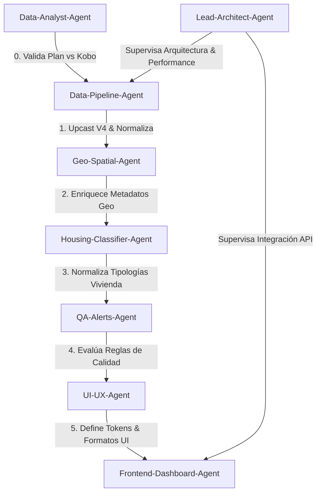

# Definición de Agentes de Desarrollo 🤖

Este documento define el catálogo de **Agentes de Desarrollo Especializados** para el ecosistema **ESCA V3 / EHM** (`api-kobo-encuesta-ampliada`). Cada agente posee un rol, responsabilidades, herramientas y principios de diseño específicos para garantizar la calidad, mantenibilidad y escalabilidad del código.

---

## Catálogo de Agentes

| Agente | Nombre | Ámbito Principal | Documento |
| :--- | :--- | :--- | :--- |
| 🐍 | **Data-Pipeline-Agent** | Ingesta Kobo, Upcasting $V_1 \to V_4$, Normalización | [.agent/agents/data-pipeline-agent.md](file:///.agent/agents/data-pipeline-agent.md) |
| 🗺️ | **Geo-Spatial-Agent** | Engine R-Tree (`STRtree`), Buffers, Distancias Haversine | [.agent/agents/geo-spatial-agent.md](file:///.agent/agents/geo-spatial-agent.md) |
| 🏠 | **Housing-Classifier-Agent** | Clasificador de ocupación (Tipo A, B, C, E) y reporte | [.agent/agents/housing-classifier-agent.md](file:///.agent/agents/housing-classifier-agent.md) |
| 🛡️ | **QA-Alerts-Agent** | Motor de alertas reactivo (4 dimensiones de calidad) | [.agent/agents/qa-alerts-agent.md](file:///.agent/agents/qa-alerts-agent.md) |
| 🎨 | **UI-UX-Agent** | Sistemas de Diseño, Paletas, Accesibilidad (ui-ux-pro-max) | [.agent/agents/ui-ux-agent.md](file:///.agent/agents/ui-ux-agent.md) |
| 💻 | **Frontend-Dashboard-Agent** | UI/UX, Tabulator, Leaflet, Chart.js, IndexedDB | [.agent/agents/frontend-dashboard-agent.md](file:///.agent/agents/frontend-dashboard-agent.md) |
| 🏗️ | **Lead-Architect-Agent** | Integración global FastAPI, Performance, Reglas DRY | [.agent/agents/lead-architect-agent.md](file:///.agent/agents/lead-architect-agent.md) |
| 📊 | **Data-Analyst-Agent** | Planificación ESCA/EHM Monagas, Cruce Kobo vs Plan, Calidad de Datos | [.agent/agents/data-analyst-agent.md](file:///.agent/agents/data-analyst-agent.md) |

---

## Matriz de Colaboración de Agentes

