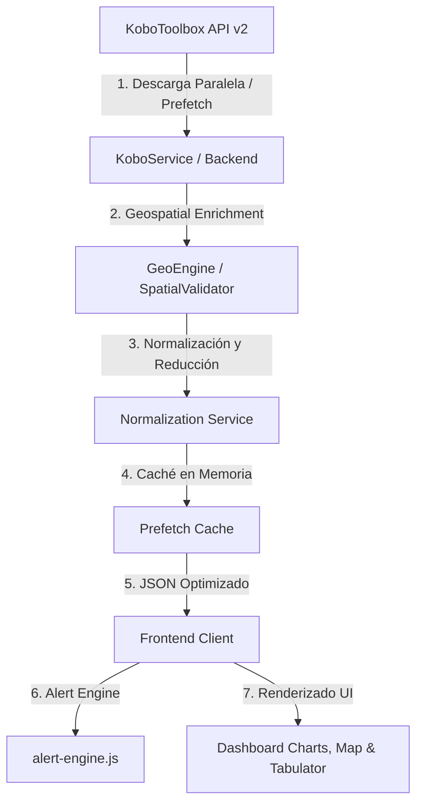

# Manual de Lógica de Negocio y Arquitectura de Datos 📊
Este documento detalla el funcionamiento interno del ecosistema **ESCA V3 / EHM**, sirviendo como guía obligatoria de lectura antes de realizar cualquier modificación al código fuente.

---

## 1. Arquitectura General y Flujo de Datos

El sistema está compuesto por un Backend en Python (FastAPI) y un Frontend interactivo (Vite + JS + Leaflet + Tabulator).

### Flujo de Inicialización del Backend:
1. Al arrancar (`lifespan` en [main.py](file:///home/seem/Documentos/_proyectos/api-kobo-encuesta-ampliada/backend/app/main.py)), el `SpatialValidator` carga y parsea los archivos GeoJSON de segmentos y controles en memoria.
2. El `KoboService` maneja un sistema de **BackgroundPrefetchCache** con pre-carga proactiva en segundo plano para evitar latencias de red en KoboToolbox.

---

## 2. Normalización de Datos y Reducción del Payload

### Mapeo Crudo (Kobo) &rarr; Esquema Interno (Backend)
El servicio [normalization.py](file:///home/seem/Documentos/_proyectos/api-kobo-encuesta-ampliada/backend/app/services/normalization.py) traduce los campos planos del JSON exportado por Kobo a claves estructuradas:
* **Identificación**:
  * `S0/cedula_encuestador` &rarr; `cedula_encuestador`
  * `S0/s0_nombreapellido` &rarr; `nombre_encuestador`
* **Ubicación Declarada**:
  * `S1/ent`, `S1/mun`, `S1/par`, `S1/nodo`, `S1/cpoblado` &rarr; `entidad`, `municipio`, `parroquia`, `nodo`, `centro_poblado`
* **Datos Catastrales**:
  * `S1/segmento` / `group_segmeto_sector/segmento` &rarr; `segmento`
  * `S1/sector` / `group_segmeto_sector/sector` &rarr; `sector`
  * `S1/manzana` &rarr; `manzana`
  * `S1/lado_manz` &rarr; `lado_manz`
  * `S1/parcela` &rarr; `parcela`
  * `S1/Edificaci_n` &rarr; `edificacion`
  * `S1/unidad` &rarr; `unidad_inmobiliaria`
  * `S1/Uso_de_la_Unidad_inmobiliaria` &rarr; `uso_unidad_inmobiliaria`
* **Control Operativo**:
  * `group_sh53u78/fecha_actual` &rarr; `fecha_actual`
  * `group_sh53u78/semana` &rarr; `semana_raw` (se extraen los últimos 2 dígitos para `semana_short`)
  * `group_sh53u78/control` o `datos_hogar/hogar/control_h` &rarr; `control`
  * `group_sh53u78/lote` &rarr; `lote`
  * `group_sh53u78/n_linea` &rarr; `n_linea`
  * `group_sh53u78/n_serie` &rarr; `n_serie`
* **Condición de Ocupación**:
  * `Condici_n_de_ocupaci_n/ingresada` &rarr; `ingresada` (Booleano)
  * `Condici_n_de_ocupaci_n/condicion_de_ocupacion` &rarr; `condicion_de_ocupacion`
  * `Condici_n_de_ocupaci_n/situacion_vivienda` &rarr; `situacion_vivienda_raw`

### Reducción del Payload (Seguridad y Rendimiento):
El método `filter_record` en el backend descarta la metadata pesada de Kobo y datos confidenciales. Reemplaza la estructura de productos (`productos_22/productos`) por una lista de objetos vacíos del mismo tamaño, manteniendo intacta la lógica de conteos del frontend sin enviar bytes innecesarios.

---

## 3. Motor de Validación Geoespacial (Shapely / STRtree)

El backend realiza dos comprobaciones espaciales críticas utilizando polígonos e índices espaciales R-Tree (`STRtree`):

1. **Localización de Segmento Real** (en [geo_service.py](file:///home/seem/Documentos/_proyectos/api-kobo-encuesta-ampliada/backend/app/services/geo_service.py)):
   * Toma el punto de geolocalización final de la encuesta (`ubicacion_f` / `ubicacion_i`).
   * Consulta el `STRtree` de `segmentos_monagas.geojson` para encontrar el polígono contenedor.
   * **Tolerancia**: Si el punto no cae exactamente dentro de ningún polígono, se genera un buffer de `0.0015 grados` (~165 metros) alrededor del punto para buscar segmentos secantes.
   * El código del segmento real encontrado se guarda en `_geo_meta.actual_seg`.

2. **Cercanía al Punto de Control Teórico** (en [spatial_validator.py](file:///home/seem/Documentos/_proyectos/api-kobo-encuesta-ampliada/backend/app/services/spatial_validator.py)):
   * Construye una clave única del control: `{control_id}-{serie}-{linea}`.
   * Busca la ubicación teórica en `CONTROLES.geojson`.
   * Calcula la distancia Haversine en metros entre la ubicación de captura y el punto teórico (`distance_to_control`).

---

## 4. Reglas del Motor de Alertas (Alert Engine)

Las alertas se definen de forma declarativa en el frontend ([config.js](file:///home/seem/Documentos/_proyectos/api-kobo-encuesta-ampliada/frontend/js/core/config.js)) y se evalúan cruzando los flags del backend con reglas del frontend ([alert-engine.js](file:///home/seem/Documentos/_proyectos/api-kobo-encuesta-ampliada/frontend/js/data/alert-engine.js)):

| Código de Alerta | Etiqueta | Origen / Regla de Negocio | Detalle |
| :--- | :--- | :--- | :--- |
| **`APERT_LEJOS`** | Apertura Distante | Frontend: `turf.distance` | Distancia entre la apertura del formulario (`start-geopoint`) y el punto manual de inicio > **500 m**. |
| **`FUERA_SEGMENTO`** | Fuera de Cobertura | Mixto: Backend / Frontend | El punto GPS de captura está a más de **600 m** del centro del segmento asignado. |
| **`TIEMPO_CORTO`** | Velocidad Sospechosa | Frontend | Duración de la encuesta completada es menor a **15 minutos** (general). |
| **`TIEMPO_CORTO_EHM`** | Rapidez Inusual (EHM) | Frontend: `DUR_MIN_EHM` | Encuesta EHM efectiva de una sola persona completada en menos de **10 minutos**. |
| **`TIEMPO_CORTO_ESCA`** | Rapidez Inusual (ESCA) | Frontend: `DUR_MIN_ESCA` | Encuesta ESCA efectiva completada en menos de **15 minutos**. |
| **`TIEMPO_LARGO`** | Duración Larga | Frontend: `DUR_MAX_OK` | Encuesta completada supera los **45 minutos**. |
| **`SEGMENTO_INCORRECTO`** | Segmento Erróneo | Mixto: Backend / Frontend | El código del segmento detectado por el GPS (`actual_seg`) no coincide con el declarado por el encuestador. |
| **`ARRANQUE_INCONSISTENTE`**| Arranque Incorrecto | Frontend | Hay productos declarados pero el número de arranque (`productos_22/arranque`) está vacío. |
| **`LINEA_SERIE_INVALIDA`** | Inconsistencia Línea/Serie| Frontend: `controlsIndex` | El combo `{control}-{serie}-{linea}` no existe en la base de datos oficial (`CONTROLES.geojson`). |
| **`CEDULA_INVALIDA`** | Cédula Inválida | Frontend | La cédula del encuestador no es estrictamente numérica o su longitud está fuera del rango **6–9** dígitos. |
| **`INGRESO_ANOMALO`** | Ingreso Anómalo | Frontend: `INGRESO_MAX` | Algún integrante declara ingresos fuera de rango razonable (**1 Bs.** a **9.999.999 Bs.**). |
| **`DESPLAZAMIENTO_ANOMALO`**| Desplazamiento Anómalo| Frontend | La distancia entre el punto de inicio de la encuesta y el de cierre supera los **30 metros**. |
| **`HOGARES_INCONSISTENTES`**| Hogares Inconsistentes | Backend: `flag_hogar_count_mismatch` | Cantidad de hogares declarados difiere de los registrados en el bloque repetitivo. |
| **`INTEGRANTES_INCONSISTENTES`**| Integrantes Inconsistentes| Backend | La lista de integrantes por hogar no coincide con el total de miembros declarado. |
| **`CONTROL_DISTANTE`** | Control Distante | Backend: `flag_far_from_control` | El punto de captura GPS está a más de **600 m** del punto de control teórico. |

---

## 5. Consideraciones para Desarrolladores (Antes de Modificar)

1. **Evitar Cálculos Redundantes (DRY)**:
   Las validaciones espaciales costosas (como el cálculo del segmento real o la distancia al punto de control) deben hacerse **siempre en el backend** durante la descarga/prefetching. El frontend debe limitarse a leer el objeto `_backend_meta` y aplicar los estilos visuales.
2. **Uso de Z-Fill en Códigos**:
   Tanto en el Frontend como en el Backend, al comparar segmentos o controles, siempre normaliza aplicando `.zfill(3)` o `.zfill(4)` para evitar falsos positivos debido a formatos numéricos (ej. comparar `"034"` con `34`).
3. **Caché Reactiva en el Cliente (IndexDB)**:
   El frontend utiliza un módulo local de caché en cliente [cache.js](file:///home/seem/Documentos/_proyectos/api-kobo-encuesta-ampliada/frontend/js/api/cache.js). Si realizas un cambio en la estructura del JSON devuelto por la API, asegúrate de refrescar la caché del navegador (`refresh=true` en el select del dashboard) para forzar la actualización de los datos guardados localmente.
4. **Validaciones Condicionales por Tipo**:
   Recuerda diferenciar los formularios **ESCA** y **EHM** al crear alertas. Algunas variables cambian de nombre en Kobo dependiendo del formulario. Usa las constantes `DUR_MIN_EHM` y `DUR_MIN_ESCA` unificadas en [config.js](file:///home/seem/Documentos/_proyectos/api-kobo-encuesta-ampliada/frontend/js/core/config.js).
